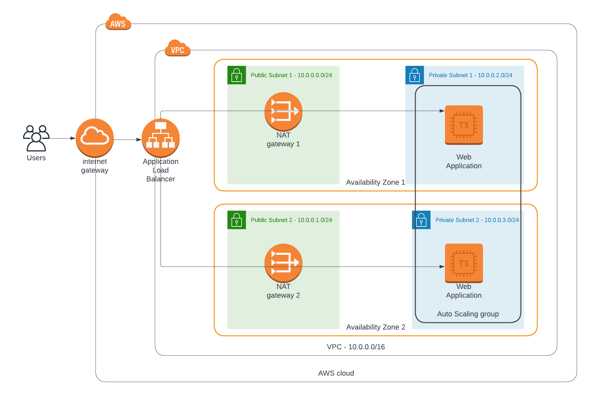
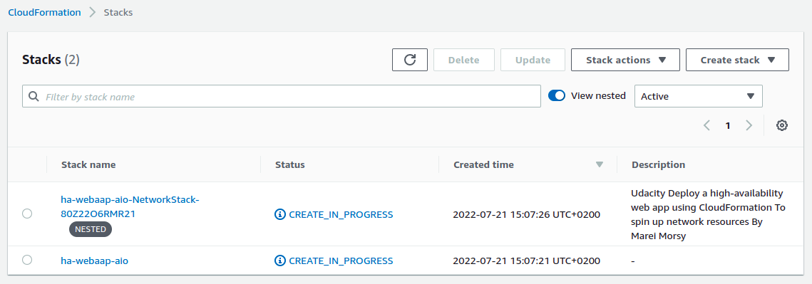
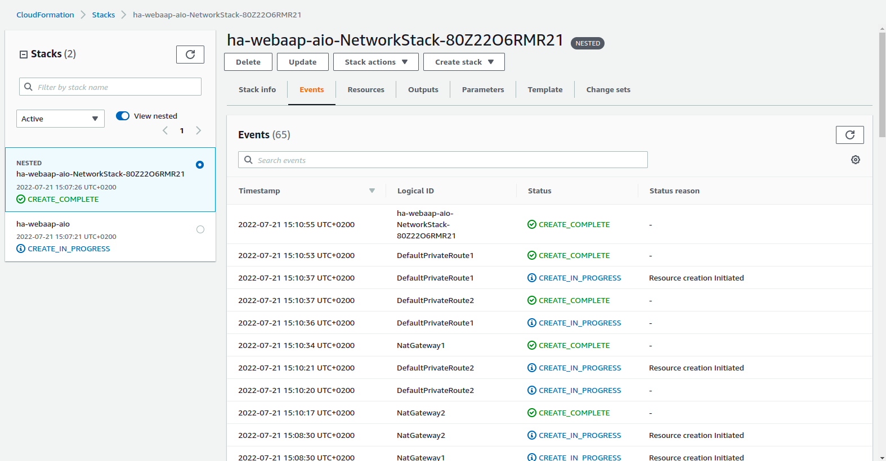
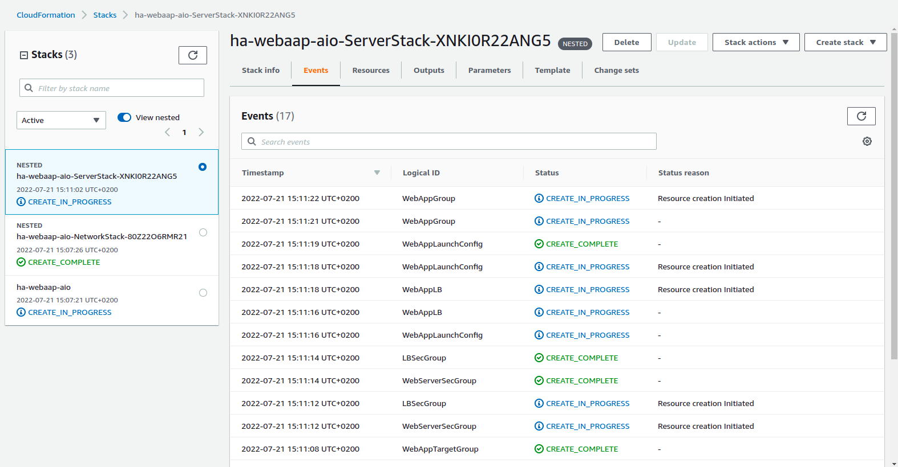
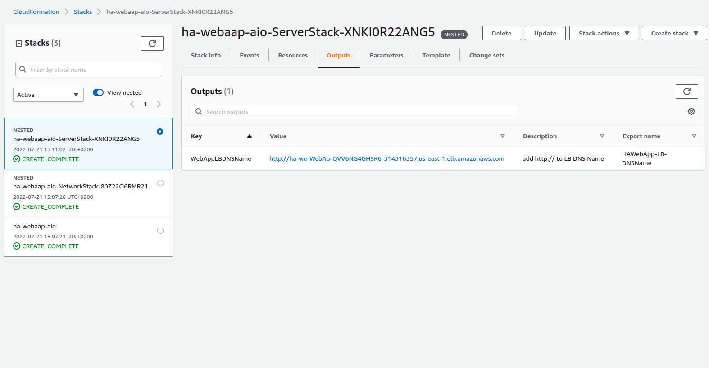
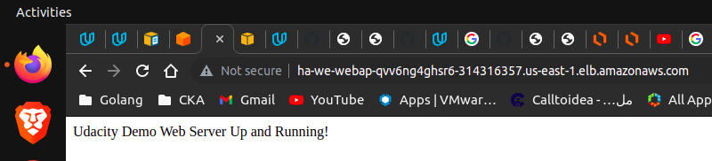

### Deploy a high-availability web app using CloudFormation
Welcome to Udacity cloud devops second project!

## Project diagram


## To run the project for the first time
```
$ ./create.sh
```

## To update the project for the next times after creation
```
$ ./update.sh
```

## To delete the stack
```
$ ./delete.sh
```

## Screenshots





