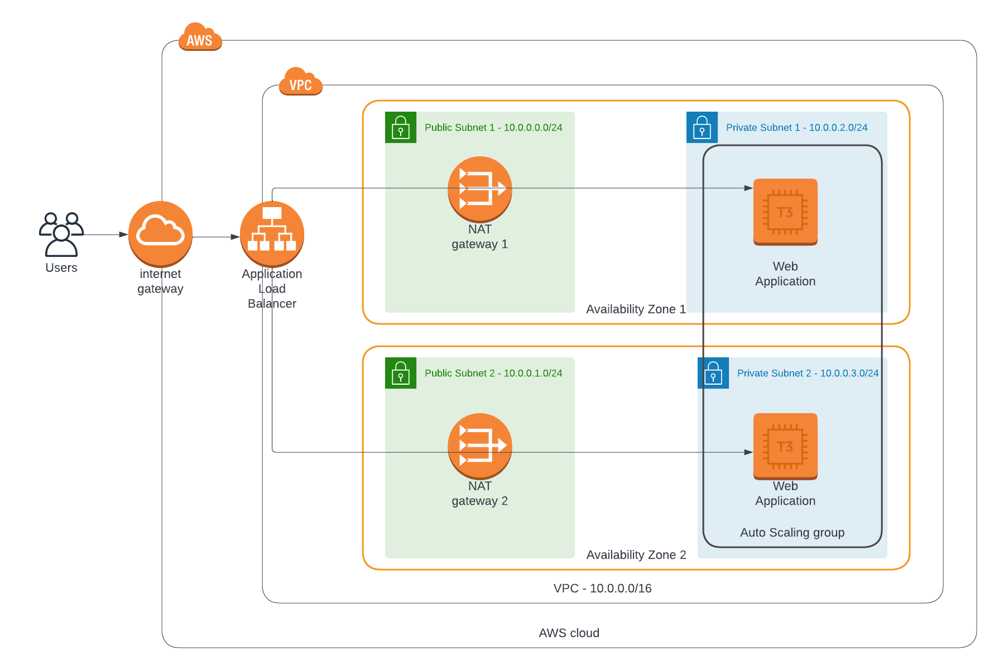

### Deploy a high-availability web app using CloudFormation
Welcome to Udacity cloud devops second project!

## Project diagram


## To run the project for the first time
```
$ ./create.sh ha-webapp final-project.yml final-project-parameters.json
```

## To run the project for next times
```
$ ./update.sh ha-webapp final-project.yml final-project-parameters.json
```

## To delete the stack
```
$ ./delete.sh ha-webapp
```